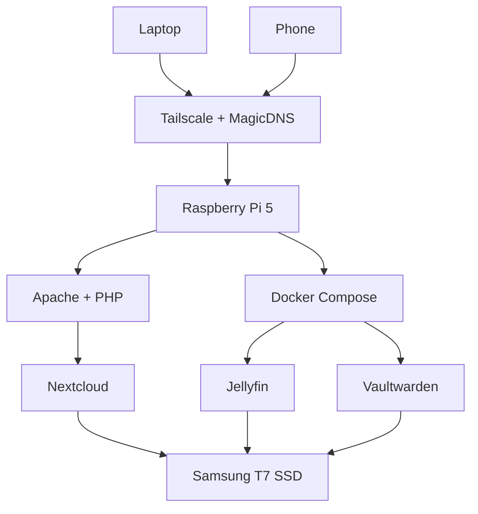

# Raspberry Pi Homelab

A self-hosted homelab built on a Raspberry Pi 5 to explore Linux system administration, networking, storage management, containerization, and self-hosting.

The server hosts services for private cloud storage, media streaming, and secure password management while providing secure remote access over Tailscale. It runs on a headless Debian 13 (Trixie) installation on a Raspberry Pi 5, with all data stored on an external Samsung T7 SSD.

---

## Features

- 📁 Private cloud storage with Nextcloud
- 🎬 Media streaming using Jellyfin
- 🔐 Self-hosted password manager with Vaultwarden
- 🔒 Secure remote access using Tailscale + MagicDNS
- 🐳 Docker Compose for containerized services
- 💾 Persistent storage on an external Samsung T7 SSD
- 🖥️ Headless server managed entirely over SSH

---

## Architecture

---

## Hardware

| Component | Specification |
|-----------|---------------|
| SBC | Raspberry Pi 5 |
| Storage | Samsung T7 Portable SSD (500 GB) |
| OS | Debian GNU/Linux 13 (Trixie) |

---

## Software Stack

| Category | Technology |
|----------|------------|
| Operating System | Debian GNU/Linux 13 (Trixie) |
| Web Server | Apache |
| Database | MariaDB |
| PHP | PHP 8.4 |
| Containers | Docker & Docker Compose |
| Cloud Storage | Nextcloud |
| Media Server | Jellyfin |
| Password Manager | Vaultwarden |
| Remote Access | Tailscale + MagicDNS |
| Server Management | SSH |

---

## Services

| Service | Purpose | Deployment |
|----------|---------|------------|
| Nextcloud | Private cloud storage and file synchronization | Native |
| Jellyfin | Personal media streaming | Docker Compose |
| Vaultwarden | Self-hosted password management | Docker Compose |

---

## What I Learned

This project provided hands-on experience with:

- Linux system administration
- Docker Compose and container management
- Apache, PHP, and MariaDB configuration
- Storage management using an external SSD
- Persistent filesystem mounting
- SSH-based server administration
- Secure networking using Tailscale and MagicDNS
- Deploying and maintaining multiple self-hosted services

---

## Repository

The repository contains documentation, configuration files, and setup instructions used to build and maintain the homelab.

> **Note:** Sensitive configuration files, credentials, API keys, and personal data have been intentionally excluded from this repository.
