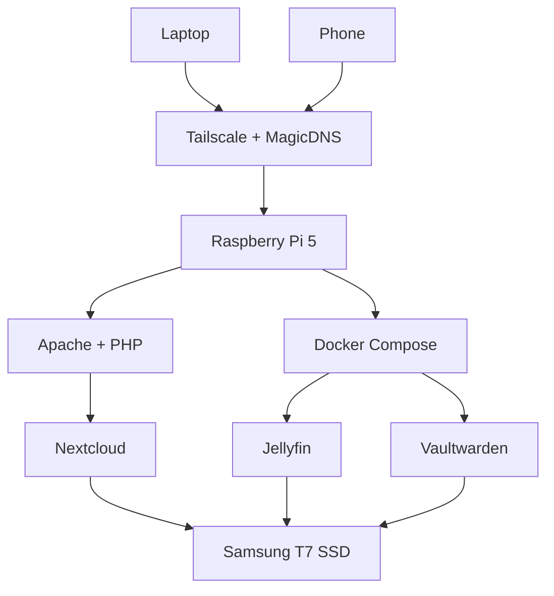
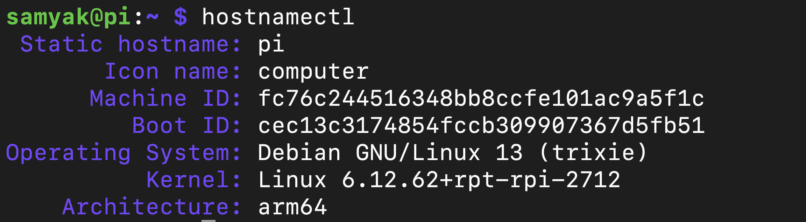
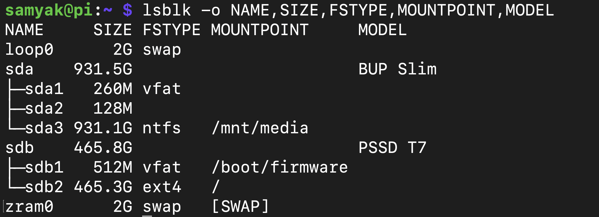
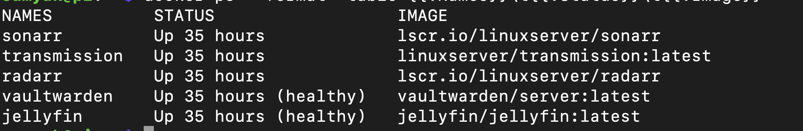
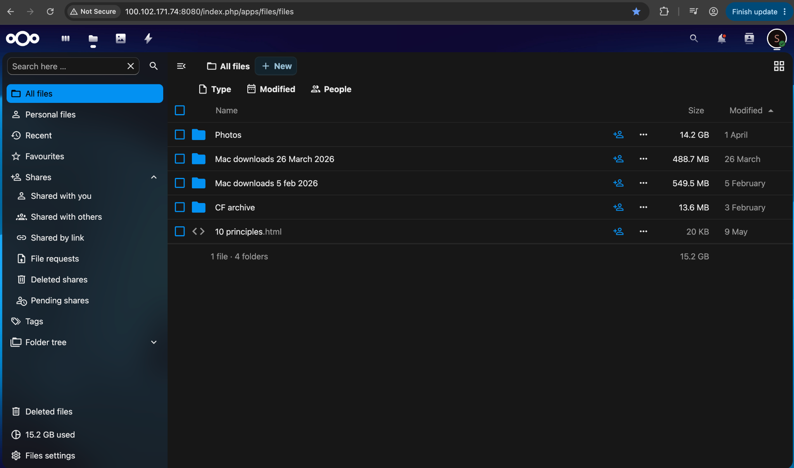
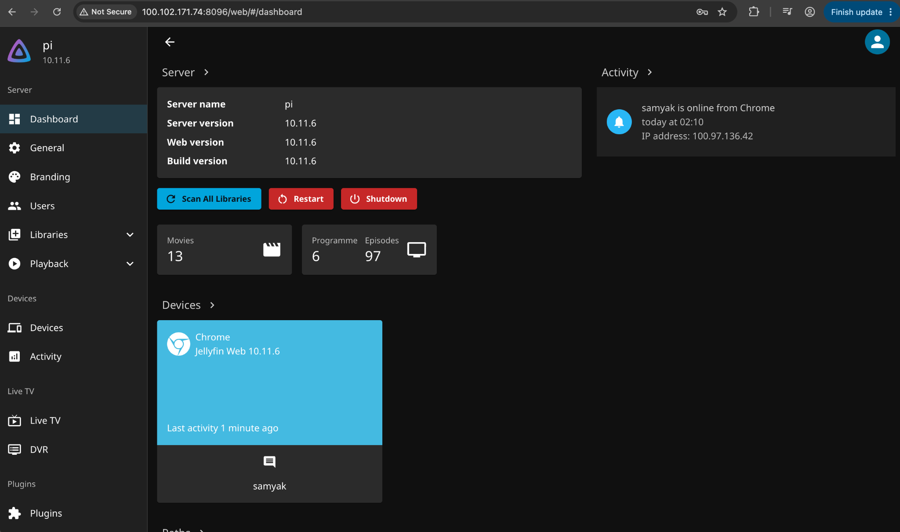
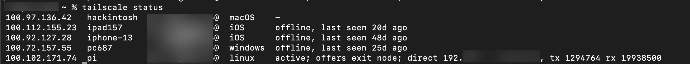

# Raspberry Pi Homelab

A self-hosted homelab built on a Raspberry Pi 5 to explore Linux system administration, networking, storage management, containerization, and self-hosting.

The server hosts several self-managed services-including private cloud storage, media streaming, and password management-while providing secure remote access through Tailscale. It runs on a headless Debian 13 (Trixie) installation with all application data stored on an external Samsung T7 SSD.

---

## Motivation

I built this project to gain hands-on experience with Linux system administration, networking, storage management, and self-hosting. It also gave me an opportunity to consolidate commonly used services-such as cloud storage, media streaming, and password management on a single low-power server while learning how to deploy, configure, and maintain them in a real-world environment.

---

## Features

- 📁 Private cloud storage with Nextcloud
- 🎬 Media streaming using Jellyfin
- 🔐 Self-hosted password manager with Vaultwarden
- 🔒 Secure remote access using Tailscale + MagicDNS
- 🐳 Docker Compose for containerized services
- 💾 Persistent storage on an external Samsung T7 SSD
- 🖥️ Headless server managed entirely over SSH

---

## Architecture

---

## Hardware

| Component | Specification |
|-----------|---------------|
| SBC | Raspberry Pi 5 |
| Storage | Samsung T7 Portable SSD (500 GB) |
| OS | Debian GNU/Linux 13 (Trixie) |

---

## Software Stack

| Category | Technology |
|----------|------------|
| Operating System | Debian GNU/Linux 13 (Trixie) |
| Web Server | Apache |
| Database | MariaDB |
| PHP | PHP 8.4 |
| Containers | Docker & Docker Compose |
| Cloud Storage | Nextcloud |
| Media Server | Jellyfin |
| Password Manager | Vaultwarden |
| Remote Access | Tailscale + MagicDNS |
| Server Management | SSH |

---

## Services

| Service | Purpose | Deployment |
|----------|---------|------------|
| Nextcloud | Private cloud storage and file synchronization | Native |
| Jellyfin | Personal media streaming | Docker Compose |
| Vaultwarden | Self-hosted password management | Docker Compose |

---

## Screenshots

### System Information

Shows the operating system running on the Raspberry Pi.

---

### Storage Configuration

The Raspberry Pi boots directly from a Samsung T7 SSD while a separate external drive stores media.

---

### Running Services

Docker containers currently running on the server.

---

### Nextcloud

Self-hosted cloud storage.

---

### Jellyfin

Media server dashboard.

---

### Tailscale

Secure remote access through a private mesh VPN.

---

## Technical Highlights

This project involved configuring and managing a self-hosted Linux server from scratch, including:

- Linux system administration
- Docker Compose and container orchestration
- Apache, PHP and MariaDB configuration
- Persistent storage using an external SSD
- Filesystem mounting and storage management
- SSH-based remote administration
- Secure networking using Tailscale and MagicDNS
- Deployment and maintenance of multiple self-hosted services

---

## Repository

This repository documents the architecture, deployment, and operation of the Raspberry Pi homelab. It includes project documentation, diagrams, screenshots, and configuration examples while excluding sensitive credentials and personal data.

> **Note:** Sensitive configuration files, credentials, API keys, and personal data have been intentionally excluded from this repository.
